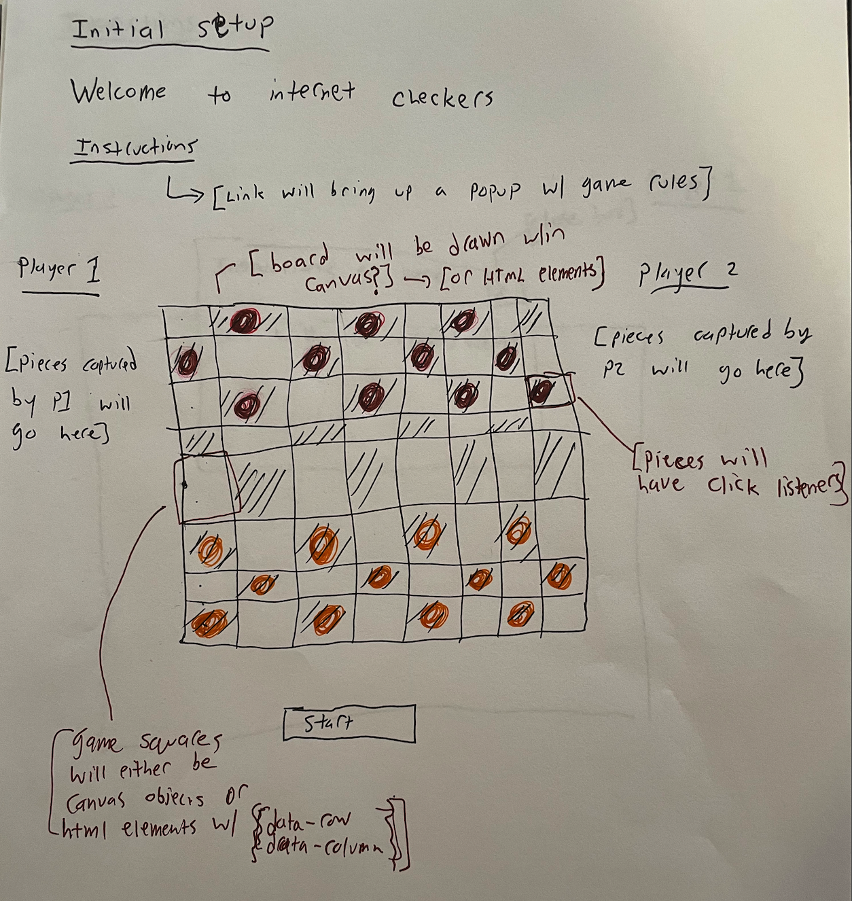

# checkers

## Project Overview

    This a checkers app. The app will exist in a single web-page which will include a header, a gameboard, and two players columns to show captured pieces. The columns will be on either side of the gameboard. A user will initialize a game by clicking a button below the board. If they wish, the user will be able to click on an 'instructions' link prior to playing (or during the game). The link will open a transparent pop-up which explicates the rules of the game. 

    During gameplay, players will alternate making "valid" moves according to the rules pulled from the "checkers" wikipedia page (see general rules @ https://en.wikipedia.org/wiki/Checkers). (The only modification I will make is that capture will not be mandatory.) Both players will share the same screen, and the app will prevent players from making invalid moves and will only allow the current player to make a move. The app will have to handle situations where both players can make a move (for instance, if player 1 could make a second capture on a "double-jump" but elects not to.)

    Gameplay will proceed until a win condition is met or until the user opts to start a new game (perhaps because the players have reached a stalemate). Either player will win when they have captured all of the opposing players pieces. Alternatively, a player will win if the opposing player does not have any valid moves on their turn.

## User stories
    --As a user, I want to be able to play checkers against myself or a friend
    --As a user, I want to be reminded of the rules in an unobstrusive but obvious way
    --As a user, I want to be able to see valid moves when I hover over a gamepiece
    --As a user, I want to be prevented from making invalid moves
    --As a user, I want to be able to drag a game piece to a square with my mouse and "release" it onto it's new square. 
    --As a user, I want to see a captured piece move into the correct column 
    --As a user, I want to easily see the pieces my opponent and I have captured. 
    --As a user, I want to be able to gain a "king" piece by reaching the end of my opponent's side.
    --As a user, I want the game to end when someone has won and I want to be able to start a new game.
    --As a user, I want to be able to start a new game before someone has won

## Wireframes:

##### Main page

##### When instructions link is clicked

##### During Play

During play users will select pirces and be able to capture opponent pieces.

##### Victory

When a win condition is met, a popup will inform users.

## Entity Relationships

The two main object types to keep track of will be the game board and the game pieces. Pieces will sit on the game board and the board object will track which tokens are where (not literally, but it will track what types of tokens are on each square). Each token will store its row/column info. 

##### Objects and functions 

## Schedule
##### Day 1: get gameboard and game pieces set up 
##### Day 2: make sure pieces can be clicked and "lift" off page and can be "dropped" onto another square
##### Day 3: make sure pieces can only be dropped into appropriate squares and game can alternate 
##### Day 4: win conditions and starting a new game
##### Day 5: troubleshoot and cleanup 

